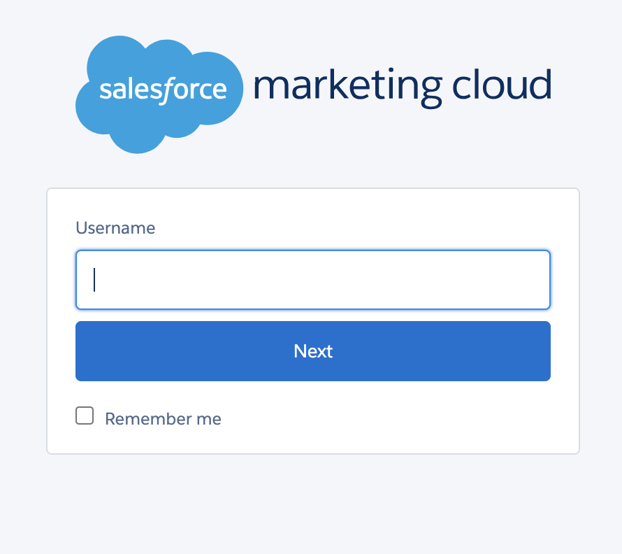
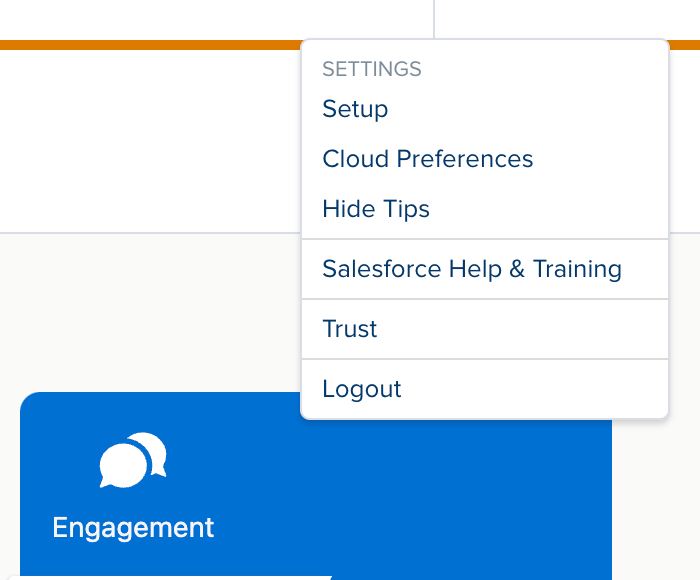
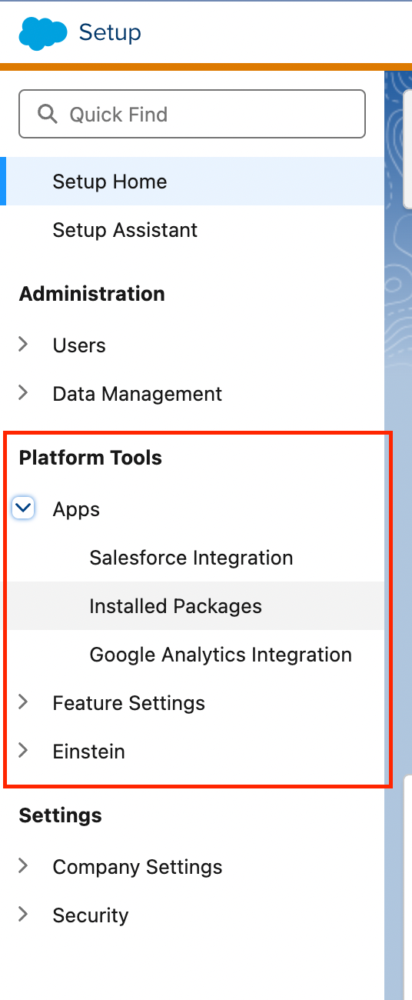
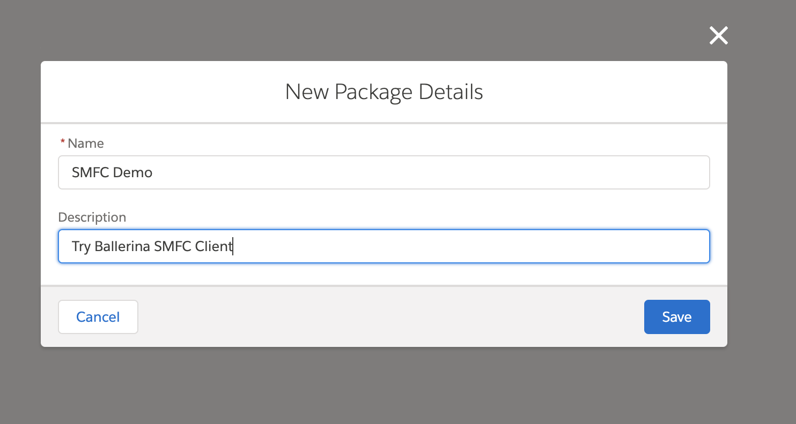
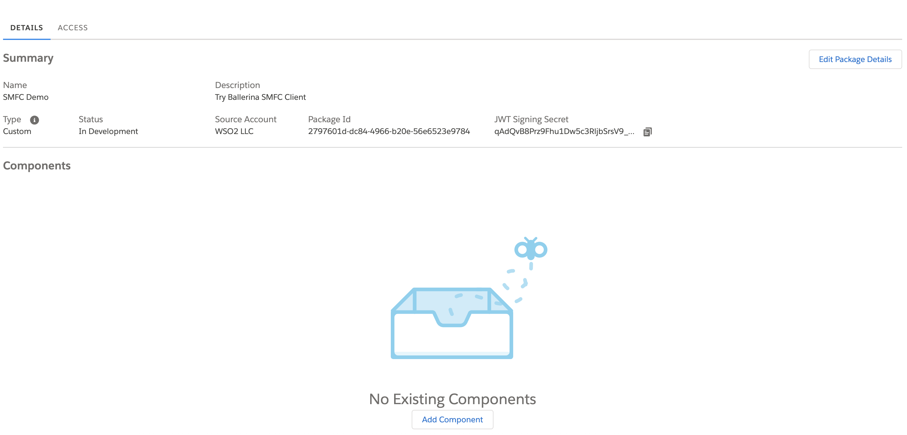
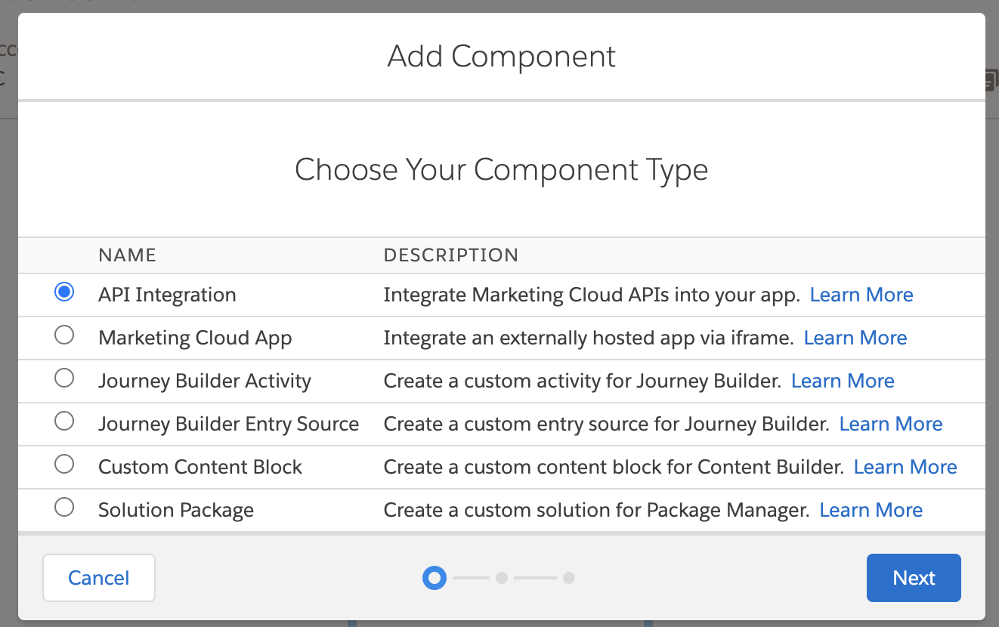
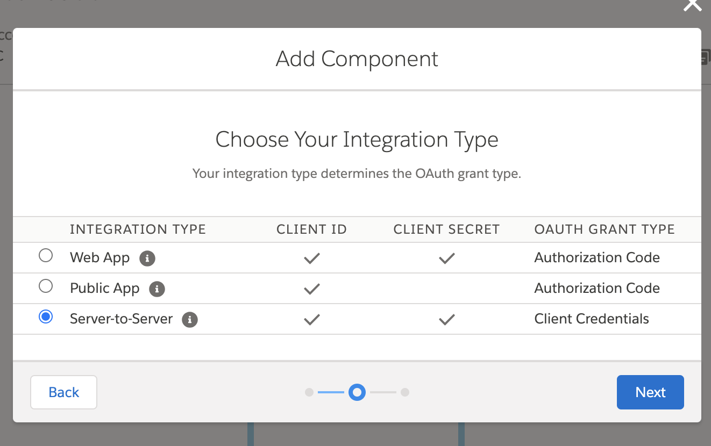
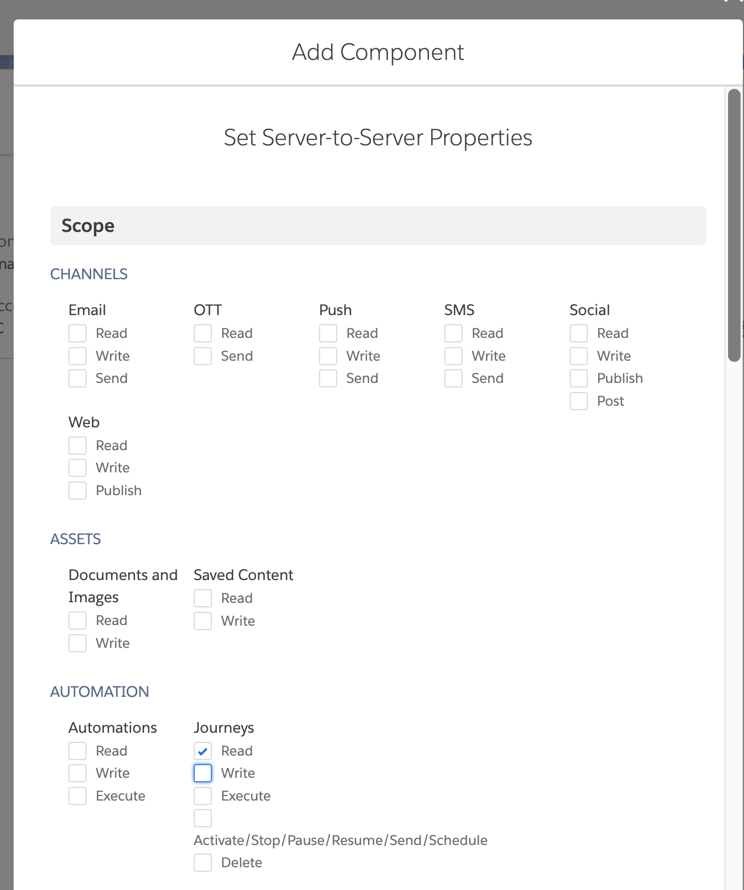
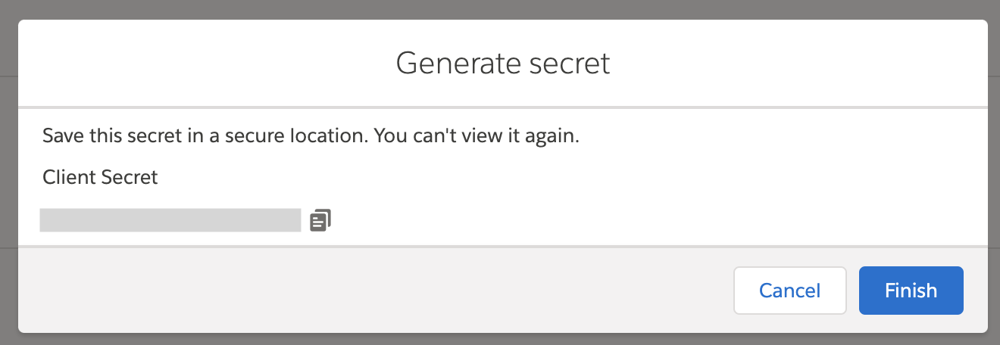
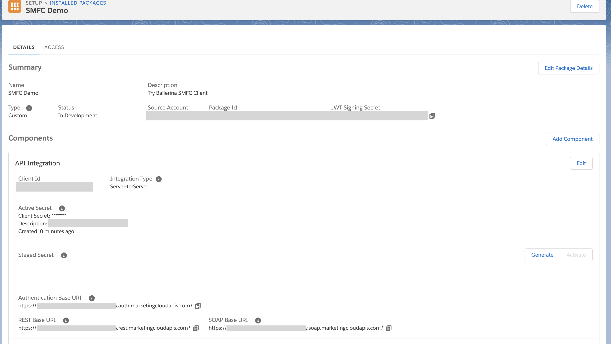

## Overview

[Salesforce Marketing Cloud](https://www.salesforce.com/products/marketing-cloud/overview/) is a leading digital marketing platform that enables businesses to manage and automate customer journeys, email campaigns, and personalized messaging.

The `ballerinax/salesforce.marketingcloud` package provides APIs to connect and interact with [Salesforce Marketing Cloud API](https://developer.salesforce.com/docs/atlas.en-us.mc-apis.meta/mc-apis/) endpoints, supporting a wide range of marketing automation and journey management

## Setup guide

This guide explains how to generate an access token in Salesforce Marketing Cloud using an Installed Package. 

### Step 1: Log in to Marketing Cloud

1. Navigate to your [Salesforce Marketing Cloud login page](https://mc.exacttarget.com/cloud/login.html) and log in with your credentials.

   

2. Once logged in, click on your username in the top right corner and select Setup from the dropdown menu.

   

### Step 2: Create an installed package

1. In the **Setup** menu, scroll down to the **Platform Tools** section.
2. Click on **Apps** and then select **Installed Packages**.

   

3. Click the **New** button.
4. Enter a **Name** and **Description** for your package (for example, `API Integration Package`).
5. Click **Save**.

   

### Step 3: Add an API integration component

1. After saving, click on the package you just created to view its details.

   

2. Click on **Add Component**.
3. Choose **API Integration** as the component type.

   

4. Select Server-to-Server as the integration type.

   

5. In the list of available scopes, check the required permissions for your integration. For most token generation and API calls, you might need:
   * Read and Write access to Email Studio
   * Access to the REST API
   * Any additional scopes based on your specific use case

     

6. Click **Save** to add the component.

### Step 4: Retrieve the Client ID and Client Secret

On the package detail page, note down the Base URIs, Client ID and Client Secret generated for your integration. These credentials are required to authenticate API calls.
If necessary, click on Edit to update any integration details or to add further scopes.





### Step 5: Retrieve your user subdomain

Extract the subdomain by taking the portion between `https://` and `.auth.marketingcloudapis.com` in your base URI. For example, from `https://mc123456gkz1x4p5b9m4gzx5b9.auth.marketingcloudapis.com/`, the subdomain is `mc123456gkz1x4p5b9m4gzx5b9`.

## Quickstart

To use the `salesforce.marketingcloud` connector in your Ballerina application, modify the `.bal` file as follows:

### Step 1: Import the module

Import the `salesforce.marketingcloud` module.

```ballerina
import ballerinax/salesforce.marketingcloud;
```

### Step 2: Instantiate a new connector

Create a `marketingcloud:ConnectionConfig` with the obtained OAuth2.0 tokens and initialize the connector with it.

```ballerina
configurable string clientId = ?;
configurable string clientSecret = ?;
configurable string subDomain = ?;

marketingcloud:Client marketingCloudClient = check new (
    config = {
        auth: {
            clientId,
            clientSecret
        }
    },
    subDomain = subDomain
);
```

### Step 3: Invoke the connector operation

Now, utilize the available connector operations.

#### Get unread emails in INBOX

```ballerina
marketingcloud:ContactMembershipResponse res = 
        check marketingCloudClient->getContactMembership({
            contactKeyList: ["test@example.com"]
        });
```

## Examples

The `ballerinax/salesforce.marketingcloud` connector provides practical examples illustrating usage in various scenarios. Explore these [examples](https://github.com/ballerina-platform/module-ballerinax-salesforce.marketingcloud/tree/main/examples) to understand how to capture and process database change events effectively.

1. [Welcome Journey](https://github.com/ballerina-platform/module-ballerinax-salesforce.marketingcloud/tree/main/examples/welcome-journey) - Demonstrates how to enroll new users into the Welcome Journey. It includes additional checks to ensure that users are not enrolled more than once, preventing duplicate enrollments in the journey.

## Build from the source

### Setting up the prerequisites

1. Download and install Java SE Development Kit (JDK) version 21. You can download it from either of the following sources:

    * [Oracle JDK](https://www.oracle.com/java/technologies/downloads/)
    * [OpenJDK](https://adoptium.net/)

   > **Note:** After installation, remember to set the `JAVA_HOME` environment variable to the directory where JDK was installed.

2. Download and install [Ballerina Swan Lake](https://ballerina.io/).

3. Download and install [Docker](https://www.docker.com/get-started).

   > **Note**: Ensure that the Docker daemon is running before executing any tests.

4. Export Github Personal access token with read package permissions as follows,

    ```bash
    export packageUser=<Username>
    export packagePAT=<Personal access token>
    ```

### Build options

Execute the commands below to build from the source.

1. To build the package:

   ```bash
   ./gradlew clean build
   ```

2. To run the tests:

   ```bash
   ./gradlew clean test
   ```

3. To build the without the tests:

   ```bash
   ./gradlew clean build -x test
   ```

4. To run tests against different environments:

   ```bash
   ./gradlew clean test -Pgroups=<Comma separated groups/test cases>
   ```

5. To debug the package with a remote debugger:

   ```bash
   ./gradlew clean build -Pdebug=<port>
   ```

6. To debug with the Ballerina language:

   ```bash
   ./gradlew clean build -PbalJavaDebug=<port>
   ```

7. Publish the generated artifacts to the local Ballerina Central repository:

    ```bash
    ./gradlew clean build -PpublishToLocalCentral=true
    ```

8. Publish the generated artifacts to the Ballerina Central repository:

   ```bash
   ./gradlew clean build -PpublishToCentral=true
   ```

## Contribute to Ballerina

As an open-source project, Ballerina welcomes contributions from the community.

For more information, go to the [contribution guidelines](https://github.com/ballerina-platform/ballerina-lang/blob/master/CONTRIBUTING.md).

## Code of conduct

All the contributors are encouraged to read the [Ballerina Code of Conduct](https://ballerina.io/code-of-conduct).

## Useful links

* For more information go to the [`salesforce.marketingcloud` package](https://central.ballerina.io/ballerinax/salesforce.marketingcloud/latest).
* For example demonstrations of the usage, go to [Ballerina By Examples](https://ballerina.io/learn/by-example/).
* Chat live with us via our [Discord server](https://discord.gg/ballerinalang).
* Post all technical questions on Stack Overflow with the [#ballerina](https://stackoverflow.com/questions/tagged/ballerina) tag.
